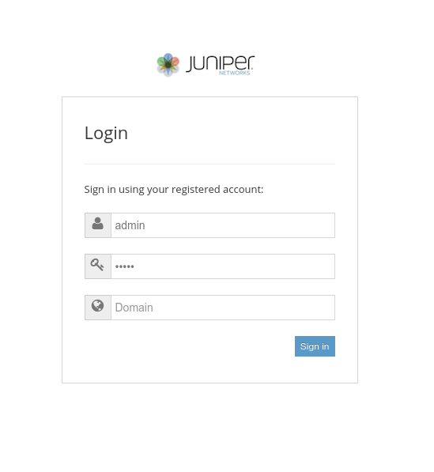
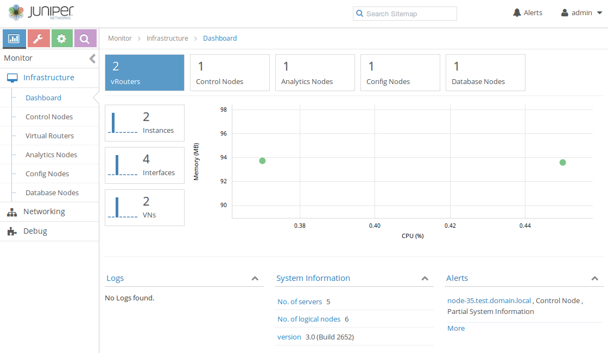

Basic Contrail Operations
=========================

This document describes very basic operations with Contrail UI.
For detailed information on Contrail operations, please refer to official `Juniper documentation
<http://www.juniper.net/techpubs/en_US/contrail2.0/information-products/pathway-pages/getting-started.html#configuration>`_.

Logging in
----------

Log into Contrail UI using the `OpenStack admin credentials.
<https://docs.mirantis.com/openstack/fuel/fuel-6.1/user-guide.html#access-permissions-for-horizon>`_

Checking services status
------------------------

Verify the status of Contrail Control Analytics and Config nodes along with vRouters in *Infrastructure* using *Dashboard*
tab of the left-hand *Monitor* menu.

Creating the virtual networks
-----------------------------

 *  Open left-hand *Configure* menu and click *Networking* option. Enter *Networks* tab and use “+” sign at the right
    side to create a new virtual network. Enter the network name and add an IP subnet. Gateway address will be added automatically.

    .. image:: images/contrail-create-net.png

 *  To create an external network, you need to add ``Shared`` and ``External``  flags to the created network using
    the ``Advanced Options`` sections and provide a proper Routing mark in Route Targets section to let this network to be
    announced to public routing table.
    The Routing mark is two numbers divided by a semicolon, e.g. 64512:10000.

    .. image:: images/contrail-create-ext-net.png

